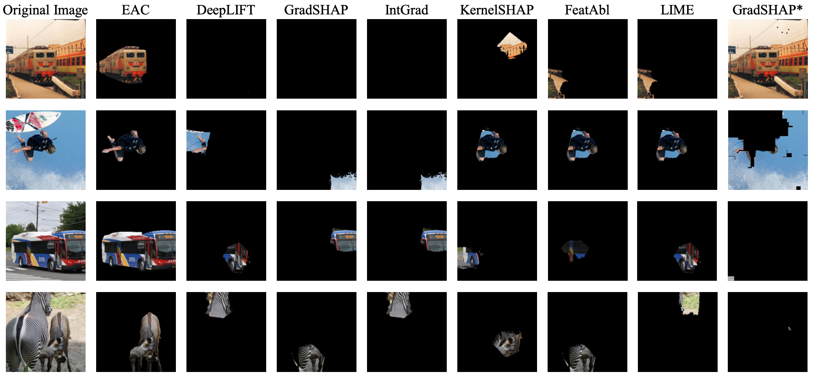
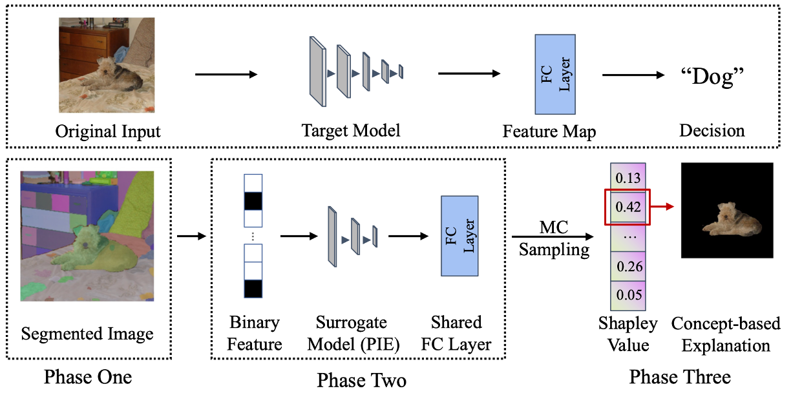
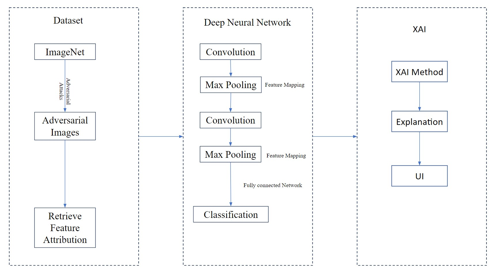
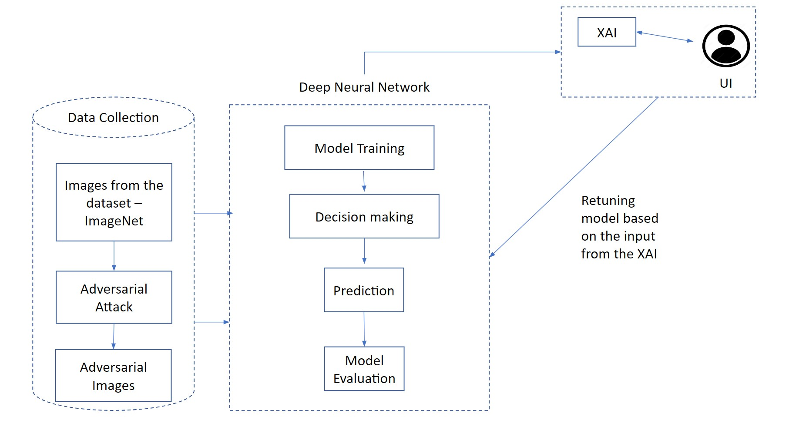
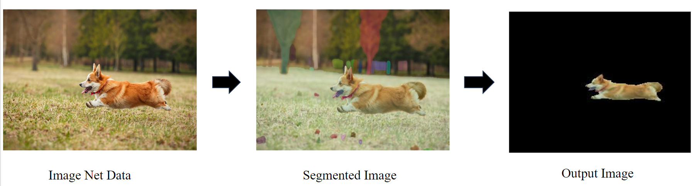
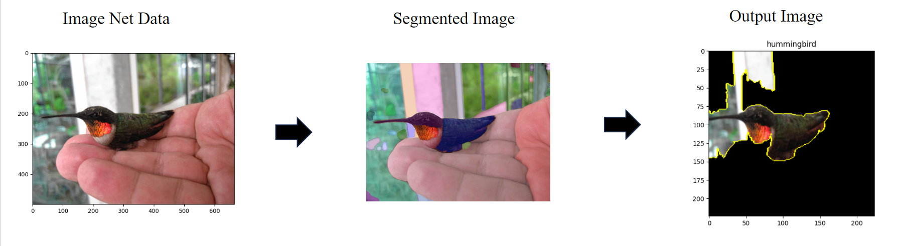

# DSCI-601 & 602: Applied Data Science I & II (Capstone project)

# My Code Version of the Paper: "Explain Any Concept: Segment Anything Meets Concept-Based Explanation"

This repository contains the code implementation of the paper titled "Explain Any Concept: Segment Anything Meets Concept-Based Explanation." [Preprint](https://arxiv.org/abs/2305.10289).
.

## Environment Setup

### Python Environment

#### Using Dedicated Python Virtual Environment

1. Create a virtual environment (replace `your_env_name` with your preferred name):

    ```bash
    python -m venv your_env_name
    ```

2. Activate the virtual environment:

    - **On Windows:**
    
        ```bash
        .\your_env_name\Scripts\activate
        ```

    - **On macOS/Linux:**
    
        ```bash
        source your_env_name/bin/activate
        ```

#### Using Anaconda

1. Create a new conda environment (replace `your_env_name` with your preferred name):

    ```bash
    conda create --name your_env_name python=3.8
    ```

2. Activate the conda environment:

    ```bash
    conda activate your_env_name
    ```

### Prerequisites

PyTorch Installation

Install PyTorch by following the instructions on the PyTorch [website](https://pytorch.org/get-started/locally/).

Install the required packages from the `requirements.txt` file:

```bash
pip install -r requirements.txt
```

## Implementation

EAC approach of the paper to generate high accurate and human-understandable post-hoc explanations.


### Architectural Diagram



### Domain Driven Diagram




### ViT-H as the Default SAM Model

Our default SAM model is ViT-H. To download the pre-trained model and install dependencies, please consult the SAM repository. [SAM repo](https://github.com/facebookresearch/segment-anything#model-checkpoints).


### To Run SAM

```
python sam.py
```

### To Run ResNet-50

```
python resnet.py
```

### To Run EAC

```
python explainanyconcept.py
```

### To Run limeXAI

```
python limexai.py
```

## DEMO

### Base Image

.

.

### Output of Explain any concept

For the EAC

.

For the LimeXAI

.

## External Code Reference

We utilize code from the following repository to enhance our implementation:

[SAMSHAP Repository](https://github.com/Jerry00917/samshap): Please refer to this repository for additional features or enhancements.

## External Resources

We would like to acknowledge and express our gratitude to the following resources that have greatly contributed to this project:

[Microsoft ResNet-50](https://huggingface.co/microsoft/resnet-50): Utilized for advanced image classification.
[Tiny ImageNet Dataset](https://huggingface.co/datasets/zh-plus/tiny-imagenet): Used for training and evaluation.
[Segment Anything Method (SAM)](https://segment-anything.com/): Incorporated into our project for segmentation tasks.
[LIME (Local Interpretable Model-agnostic Explanations)](https://marcotcr.github.io/lime/): Applied for interpretable model explanations.
PyTorch](https://pytorch.org/): The deep learning framework underlying our implementation.
[Hugging Face](https://huggingface.co/): Leveraged for model training and various NLP-related tasks.